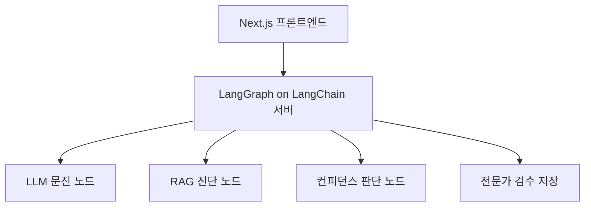
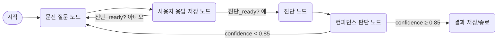

# 8체질 진단 시스템 아키텍처

당신이 계획하는 LangChain + LangGraph 기반의 8체질 진단 시스템은 **다중 턴 대화**, **조건 기반 추론**, **프롬프트 관리**, **RAG 통합**, 그리고 **전문가 검수**라는 복합 기능이 통합된 구조입니다. 이를 위해 다음과 같은 아키텍처와 구현 전략을 제안드립니다:

## 전체 아키텍처 개요



## 단계별 상세 설계

### 1. 🧾 사용자 문진 수집 (LLM 대화형 질문 생성)

- LangGraph에서 `문진 질문 노드(questionNode)` 생성  
- 이전까지 수집된 `user_answers` 상태를 LLM에 전달해 다음 질문을 **자동 생성**  
- LLM이 생성한 질문을 사용자에게 전송하고 응답을 기다림  
- 이 과정을 **최대 10회** 반복하며 `question_count`를 증가시킴

```json
// LangGraph 상태 구조 예시
{
  "user_answers": [
    { "question": "...", "answer": "..." },
    // ...
  ],
  "question_count": 4,
  "diagnosis_ready": false,
  "confidence": null
}
```

### 2. 🧠 체질 진단 노드 (RAG + LLM + JSON 출력)

- 질문이 8~10회 하고 LLM이 진단이 가능하다고 판단되면 `진단 노드` 진입  
- RAG를 사용해 전문가 사례 DB에서 유사한 패턴 참조  
- `constitution_prompt.md`를 system prompt로 로딩 + 사용자 응답 반영  
- 출력 형식:

```json
{
  "체질": "금양",
  "진단이유": "고기 섭취 후 불편함, 해산물 선호, 인삼 부작용",
  "confidence": 0.83
}
```

> **LangChain에서 사용할 RAG 방법**  
> - `RetrievalQAChain` 또는 `ConversationalRetrievalChain`  
> - retriever: `VectorStoreRetriever` (예: Chroma, FAISS)  
> - 전문가 사례 데이터를 chunk하여 embedding

### 3. 📉 Low confidence 대응 노드

- 진단 후 `confidence < threshold (예: 0.7)`이면:

#### A. 사용자에게 추가 질문

- LangGraph에서 다시 `문진 노드`로 분기  
- "확신이 어렵습니다. 몇 가지 추가 질문 드릴게요."

#### B. LLM에게 다시 진단 시도

- 이전 응답 + RAG context 그대로 사용하여 `진단 재시도`

> LangGraph에서는 `if-else` 분기 노드로 구현 가능합니다.

### 4. 📂 프롬프트 버전 관리 시스템

- `constitution_prompt.md`, `diagnosis_prompt_v2.md` 등 프롬프트 파일을 디스크 또는 Notion 기반으로 관리  
- LangChain에서 `loadPrompt(template_name)` 방식으로 유연하게 연결

```ts
import { loadPrompt } from "./promptLoader.ts";
const prompt = await loadPrompt("constitution_prompt.md");
```

### 5. 👨‍⚕️ 전문가 검수 시스템

#### 구조

- 사용자 질문/답변, 진단 결과, RAG 참고 내용, LLM 진단 이유 → 하나의 JSON으로 저장

```json
{
  "session_id": "abc123",
  "answers": [ /* ... */ ],
  "diagnosis": {
    "constitution": "금양",
    "confidence": 0.82,
    "reasoning": "..."
  },
  "retrieved_docs": ["문서 요약 1", "문서 요약 2"],
  "llm_prompt": "사용된 프롬프트 내용"
}
```

#### 프론트 구현 (Next.js)

- 관리자 페이지에 대화 기록 테이블 제공  
- 각 진단 결과 확인 및 `진단 수정` 기능 (수정 시 히스토리 보존)  
- 수정된 체질 결과는 `verified_by_expert: true`로 기록

### 6. ✅ 주요 기술 구성요소 요약

| 구성            | 도구                                            |
| --------------- | ----------------------------------------------- |
| LLM             | OpenAI / Claude / Mistral                        |
| RAG DB          | Chroma / FAISS + LangChain Retriever             |
| LangGraph       | 질문 흐름 + 조건 분기 관리                       |
| 상태 저장       | LangChain Graph State                            |
| 프롬프트 관리   | JSON 템플릿 + 동적 로더                          |
| 검수 DB         | MongoDB 또는 Firebase Firestore                  |
| 프론트엔드      | Next.js + Tailwind + (Prisma 선택)               |

## 추가 고려 사항

- **질문 다양화**: 질문 템플릿을 다양화하여 오버피팅 방지  
- **진단 피드백 수집**: 사용자 피드백 버튼 제공 ("맞는 것 같아요" / "잘 모르겠어요")  
- **체질별 통계 시각화**: 관리자 대시보드에서 체질별 진단 비율, 평균 confidence 등 제공  
- **LangGraph debug 모드**: 각 분기에서 호출된 노드 로깅 기능 제공

## 예시 진단 흐름 (LangGraph 시퀀스)

1. 사용자 대화 시작 → 질문 노드 진입  
2. 최대 10회 질문/응답 저장  
3. 진단 조건 충족 → RAG + LLM으로 진단  
4. `confidence < 0.7` → 추가 질문 또는 재진단  
5. JSON 결과 저장 + 전문가 검수 DB로 전달  
6. 프론트에서 결과 확인 및 수정 UI 제공



```python
# ✅ LangGraph 흐름 스캐폴딩 (LangChain + LangGraph 기반)
from langchain.chat_models import ChatOpenAI
from langchain.chains import RetrievalQA
from prompt_loader import load_prompt
from retriever import vectorstore
from langgraph import Graph

llm = ChatOpenAI(model_name="gpt-4", temperature=0)
retriever = vectorstore.as_retriever()

# 상태 초기값
initial_state = {
  "user_answers": [],
  "question_count": 0,
  "diagnosis_ready": False,
  "confidence": None,
  "diagnosis": None,
}

async def question_node(state):
  questions = await fetch_next_question(state["user_answers"])  # 질문 선택 로직
  state["question"] = questions
  return state

async def answer_node(state, user_answer):
  state["user_answers"].append(user_answer)
  state["question_count"] += 1
  state["diagnosis_ready"] = state["question_count"] >= 10
  return state

async def diagnosis_node(state):
  prompt = load_prompt("constitution_prompt.md")
  rag_chain = RetrievalQA.from_chain_type(
      llm=llm,
      chain_type="stuff",
      retriever=retriever,
      question_prompt=prompt,
  )
  user_input = "\n".join([
      f"Q: {qa['question']}\nA: {qa['answer']}" for qa in state["user_answers"]
  ])
  response = await rag_chain.acall({"query": user_input})
  parsed = json.loads(response["result"])
  state["diagnosis"] = parsed
  state["confidence"] = parsed["confidence"]
  return state

def confidence_node(state):
  return 'reask' if state["confidence"] < 0.7 else 'complete'

graph = Graph()
graph.add_node("ask", question_node)
graph.add_node("answer", answer_node)
graph.add_node("diagnose", diagnosis_node)
graph.add_node("check_confidence", confidence_node)
graph.add_edge("ask", "answer")
graph.add_edge("answer", lambda s: "diagnose" if s["diagnosis_ready"] else "ask")
graph.add_edge("diagnose", "check_confidence")
graph.add_edge("check_confidence", {"reask": "ask", "complete": "save"})
```
| 기능 | HTTP 메서드 | 경로 | 설명 |
|-----------------------------|------------|---------------------------------------|------------------------------------------------------------|
| 체질 진단 프록시 | POST | /api/v1/constitution | LLM에 체질 진단 요청 → DB에 결과(체질·이유·신뢰도) 업데이트 → 진단 결과 반환 |
| 사용자-LLM 챗 프록시 | POST | /api/v1/users/chat | 클라이언트 메시지를 LLM 서비스로 프록시 전송 → 응답 저장·전달 → 레시피 생성 시 저장 연동 |
| 레시피 자동 생성 | POST | /api/v1/recipes/auto_generate | 체질 및 선택 항목 기반으로 AI-Data LLM에 자동 레시피 생성 요청 → 생성된 레시피 DB 저장 및 반환 |
| 레시피 통계 생성 | POST | /api/v1/stats/generate | 저장된 레시피 데이터를 집계해 카테고리·난이도·체질·재료별 통계 생성 및 저장 |
| 모델·프롬프트 테스트 및 저장 | POST | /api/v1/experiment/test | 다양한 대화 세트로 모델·프롬프트 테스트 → 품질·비용 점수 계산 → 실험 결과 및 메타데이터 DB 저장 → 응답 반환 |